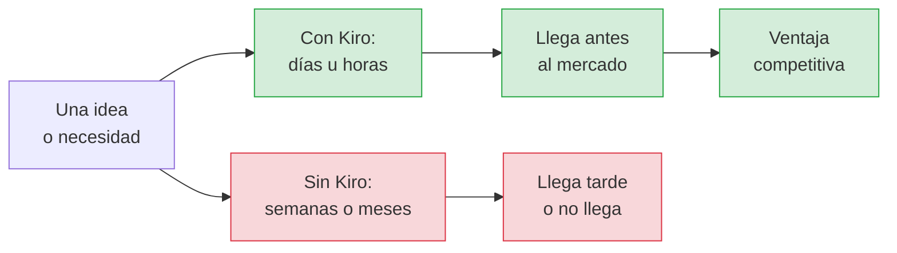
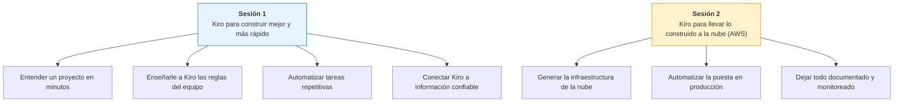
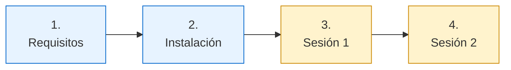

# Workshop Kiro — Fundación delamujer

**Construir software de calidad, más rápido, con inteligencia artificial.**

Bienvenido y bienvenida. Este repositorio es tu guía completa para las dos sesiones del workshop.
Aquí encuentras todo: qué preparar antes, cómo instalar las herramientas paso a paso, y qué vamos a
hacer en cada sesión.

> **¿No trabajas en tecnología?** No importa. Esta guía está escrita para que cualquier persona pueda
> seguirla, aunque nunca haya abierto una "terminal" ni sepa qué es un "repositorio". Cuando aparezca
> una palabra técnica, la explicamos. Si algo no se entiende, es culpa de la guía, no tuya.

| | |
|-------|-------|
| **Cliente** | Fundación delamujer (Colombia) |
| **Formato** | 2 sesiones de 2 horas |
| **Modalidad** | Presencial o virtual |
| **Para quién** | Cualquier persona con curiosidad. No se necesita experiencia previa |
| **Idioma** | Español |
| **Fechas** | `[POR DEFINIR]` |
| **Horario** | `[POR DEFINIR]` |
| **Herramienta principal** | [Kiro](https://kiro.dev), el asistente de desarrollo con IA de AWS |

---

## Por qué esto importa para el negocio

Antes de entrar en detalles técnicos, lo importante: **¿qué gana la organización con esto?**

Kiro es una herramienta que usa inteligencia artificial para ayudar a construir software. No
reemplaza a las personas: hace que el equipo produzca más y mejor, en menos tiempo. Traducido a
lenguaje de negocio:



### Lo que se traduce en resultados concretos

| Dimensión de negocio | Cómo ayuda Kiro |
|----------------------|-----------------|
| **Time-to-market (tiempo de salida)** | Lo que tomaba semanas se acorta a días. Una idea nueva se prueba y se lanza antes que la competencia |
| **Crecimiento** | El equipo dedica su tiempo a resolver problemas del negocio, no a tareas repetitivas. Más capacidad sin contratar más gente |
| **Calidad** | La IA ayuda a documentar, probar y validar. Menos errores llegan a producción, menos incidentes que atender |
| **Continuidad** | El conocimiento queda escrito y versionado, no en la cabeza de una sola persona. Si alguien se va, el proyecto no se detiene |
| **Costo** | Menos horas en tareas mecánicas significa menos costo por cada entrega. La documentación que "nunca hay tiempo de hacer" se genera sola |
| **Inclusión digital** | Para una entidad como Fundación delamujer, llegar más rápido con mejores servicios digitales significa acercar la inclusión financiera a más mujeres, en más lugares |

> **La idea de fondo:** el software es cada vez más el motor del crecimiento de cualquier organización.
> Quien construye software más rápido y con más calidad, crece más rápido. Kiro es una palanca directa
> sobre esa velocidad.

---

## De qué se trata el workshop

Dos sesiones, dos usos distintos de la herramienta. Ambas sobre un mismo ejemplo real y cercano: el
servicio que autoriza las transacciones de la **red de corresponsales** (esos comercios de barrio
donde uno puede hacer un retiro o pagar una cuota sin ir a una oficina).



**Sesión 1 — Construir mejor y más rápido.** Cómo entender un proyecto que uno no conoce, cómo
lograr que la IA respete las reglas del equipo, cómo automatizar lo repetitivo, y cómo conectar la
herramienta a fuentes de información confiables.

**Sesión 2 — Llevarlo a la nube.** Cómo pasar de algo que funciona en un computador a un servicio
real en la nube de AWS, con su puesta en producción automatizada y su documentación, todo revisado
antes de encenderlo.

> El ejemplo es a propósito sencillo, para que la atención esté en **cómo se usa Kiro**, no en
> entender un negocio complicado. Si te interesa el contexto del ejemplo, está en
> [docs/CASO-NEGOCIO.md](./docs/CASO-NEGOCIO.md).

---

## Cómo usar esta guía

Sigue estos pasos en orden. Los dos primeros son **antes** del workshop.



| Paso | Qué es | Cuándo | Enlace |
|------|--------|--------|--------|
| 1 | **Requisitos y preparación** — qué necesitas tener listo | Antes del workshop | [PREPARACION.md](./PREPARACION.md) |
| 2 | **Guía de instalación** — paso a paso, con Windows y Mac | Antes del workshop | [docs/INSTALACION.md](./docs/INSTALACION.md) |
| 3 | **Sesión 1** — construir mejor y más rápido | Día 1 | [sesion-1/](./sesion-1/00-bienvenida.md) |
| 4 | **Sesión 2** — llevarlo a la nube | Día 2 | [sesion-2/](./sesion-2/00-recap.md) |

> **Consejo:** si algún término te resulta extraño, abre el [Glosario sin miedo](./docs/GLOSARIO.md).
> Explica en palabras simples qué es una terminal, un repositorio, la nube y todo lo demás.

---

## Objetivos

Al terminar las dos sesiones, cada participante habrá:

1. Usado Kiro para entender y documentar un proyecto que no conocía.
2. Enseñado a Kiro las reglas y el contexto del equipo, para que no haya que repetírselas.
3. Automatizado revisiones de calidad para que ocurran solas.
4. Conectado Kiro a fuentes de información confiables de AWS.
5. Generado la infraestructura de nube del servicio, revisada automáticamente.
6. Automatizado la puesta en producción.
7. Generado la documentación y el monitoreo a partir del proyecto real.
8. Salido con un plan concreto para empezar a usarlo en su día a día.

> Las palabras técnicas de esta lista (infraestructura, producción, monitoreo) se explican en el
> [Glosario](./docs/GLOSARIO.md) y a lo largo de las sesiones. No hace falta conocerlas de antemano.

---

## Objetivos

Al terminar las dos sesiones, cada participante habrá:

1. Usado Kiro para entender y documentar un módulo de código que no escribió (onboarding asistido).
2. Creado **steering files** que codifican los estándares técnicos y el contexto de negocio del equipo.
3. Configurado **hooks** que ejecutan validaciones de calidad de forma automática.
4. Conectado Kiro a **servidores MCP** de AWS para consultar documentación y validar infraestructura.
5. Generado una plantilla **CloudFormation** completa para el servicio, validada con `cfn-lint` y `cfn-guard`.
6. Generado un **pipeline de CI/CD** en GitHub Actions que valida código e infraestructura.
7. Producido documentación operativa (arquitectura + runbook) a partir del código real.
8. Salido con un plan de adopción concreto para su equipo.

---

## Agenda

Los tiempos están en minutos relativos al inicio de cada sesión, para que funcionen con cualquier
hora de arranque. El facilitador fija el reloj real en [docs/FACILITADOR.md](./docs/FACILITADOR.md).

La columna **Prompts** es el número de prompts a Kiro de la ruta guiada de cada lab. Está ahí porque
es lo que determina si el lab cabe en su bloque: cada prompto sustancial toma entre 3 y 4 minutos
entre leer el paso, esperar la generación y revisar el resultado.

### Sesión 1 — Kiro como acelerador del desarrollo (120 min)

| Min | Bloque | Tipo | Dur | Prompts |
|-----|--------|------|-----|:-------:|
| 00–08 | [Bienvenida, objetivos y check de entorno](./sesion-1/00-bienvenida.md) | Presentación | 8 | — |
| 08–20 | [Kiro esencial: Vibe, Spec, autonomía y créditos](./sesion-1/01-kiro-esencial.md) | Teoría + demo | 12 | — |
| 20–42 | [Lab 1: Entender código que no escribiste](./sesion-1/lab1-onboarding/README.md) | Hands-on | 22 | 4 |
| 42–62 | [Lab 2: Steering files — el ADN del equipo](./sesion-1/lab2-steering/README.md) | Hands-on | 20 | 3 |
| 62–70 | Break | — | 8 | — |
| 70–88 | [Lab 3: Hooks — calidad automática sin fricción](./sesion-1/lab3-hooks/README.md) | Hands-on | 18 | 2 |
| 88–106 | [Lab 4: MCP — Kiro conectado a AWS](./sesion-1/lab4-mcp/README.md) | Hands-on | 18 | 2 |
| 106–120 | [Cierre y puente a la Sesión 2](./sesion-1/99-cierre-sesion-1.md) | Presentación | 14 | — |

### Sesión 2 — De código a infraestructura AWS (120 min)

| Min | Bloque | Tipo | Dur | Prompts |
|-----|--------|------|-----|:-------:|
| 00–06 | [Recap y objetivos](./sesion-2/00-recap.md) | Presentación | 6 | — |
| 06–18 | [De código a despliegue: qué artefactos hacen falta](./sesion-2/01-de-codigo-a-despliegue.md) | Teoría + demo | 12 | — |
| 18–52 | [Lab 5: Infraestructura generada y validada con Kiro](./sesion-2/lab5-iac/README.md) | Hands-on | 34 | 6 |
| 52–60 | Break | — | 8 | — |
| 60–80 | [Lab 6: El pipeline que valida siempre](./sesion-2/lab6-pipeline/README.md) | Hands-on | 20 | 3 |
| 80–102 | [Lab 7: Reto integrador por equipos](./sesion-2/lab7-reto/README.md) | Reto | 22 | libre |
| 102–120 | [Resultados, plan de adopción y cierre](./sesion-2/99-cierre-final.md) | Presentación | 18 | — |

### Ruta guiada y "para después"

Cada lab está partido en dos:

- **Ruta guiada:** lo que se hace en vivo. Está dimensionada para el bloque de tiempo y asume que es
  la primera vez que el participante usa Kiro.
- **Para después:** extensiones, variantes y los temas que no caben en 4 horas. Quedan en el mismo
  documento para que el repositorio siga sirviendo cuando el participante vuelva solo.

Si vas retrasado, la ruta guiada es lo que no se salta. El resto puede esperar.

---

## Antes de empezar (importante)

Dedica 45 minutos **antes** del workshop a dejar todo listo. Si llegas el día con las herramientas
instaladas, aprovechas cada minuto de las sesiones.

1. Lee y completa el checklist de [PREPARACION.md](./PREPARACION.md).
2. Sigue la [Guía de instalación paso a paso](./docs/INSTALACION.md) (con instrucciones separadas
   para Windows y para Mac).

Dos cosas no se pueden dejar para último momento:

- **Tener la cuenta de Kiro activa.** Es gratis y toma 10 minutos. La guía de instalación te lleva
  de la mano. Detalles sobre planes y créditos en [docs/GESTION-CREDITOS.md](./docs/GESTION-CREDITOS.md).
- **Instalar las herramientas base.** Son descargas sencillas; la guía tiene el enlace y los pasos
  de cada una.

> ¿Nunca instalaste nada de esto? Es normal, y la guía está hecha exactamente para ese caso. Si te
> atascas, escribe al canal de soporte del workshop antes del día de la sesión.

---

## Estructura del repositorio

```
workshop-kiro-fdlm/
├── README.md                     # Este archivo
├── PREPARACION.md                # Checklist previo al workshop
│
├── src/                          # PROYECTO BASE: servicio de corresponsales
│   ├── index.js
│   ├── corresponsales/           # Dominio: sin documentar y con defectos, a propósito
│   │   ├── tarifas.js            # Tarifas y límites por tipo de transacción
│   │   ├── comisiones.js         # Cálculo de comisión y liquidación
│   │   ├── limites.js            # Validaciones de monto, cupo y horario
│   │   └── transacciones.js      # Orquestación y comprobante
│   └── handlers/
│       └── registrarTransaccion.js  # Adaptador Lambda. Viene hecho: se lee en el Lab 5
├── tests/
│   ├── comisiones.test.js        # Cobertura mínima a propósito
│   └── registrarTransaccion.test.js
│
├── sesion-1/                     # Kiro como acelerador del desarrollo
│   ├── 00-bienvenida.md
│   ├── 01-kiro-esencial.md
│   ├── lab1-onboarding/
│   ├── lab2-steering/
│   ├── lab3-hooks/
│   ├── lab4-mcp/
│   └── 99-cierre-sesion-1.md
│
│
├── sesion-2/                     # Kiro para infraestructura AWS y DevOps
│   ├── 00-recap.md
│   ├── 01-de-codigo-a-despliegue.md
│   ├── lab5-iac/
│   ├── lab6-pipeline/
│   ├── lab7-reto/
│   └── 99-cierre-final.md
│
├── docs/
│   ├── INSTALACION.md            # Guía de instalación paso a paso (Windows y Mac)
│   ├── GLOSARIO.md               # Glosario sin miedo: términos en palabras simples
│   ├── CASO-NEGOCIO.md           # Red de corresponsales: contexto y reglas
│   ├── GESTION-CREDITOS.md       # Planes de Kiro y presupuesto de créditos
│   ├── CHEATSHEET-KIRO.md        # Referencia rápida de uso
│   ├── FACILITADOR.md            # Guía del facilitador (no repartir)
│   ├── PLAN-ADOPCION.md          # Qué hacer después del workshop
│   └── ADAPTAR-A-OTRO-CLIENTE.md # Cómo reutilizar este workshop
│
├── assets/                       # Imágenes de referencia para las guías
│
└── soluciones/                   # Artefactos de referencia (mirar al final)
    ├── steering/
    ├── hooks/
    ├── mcp/
    ├── iac/
    ├── workflows/
    └── docs/
```

> `soluciones/` contiene el resultado esperado de cada lab. Está ahí para desbloquear a quien se
> atrase y para que el material quede completo después del workshop. Intenta el lab antes de abrirla:
> el valor está en escribir el prompt, no en copiar el archivo.

---

## Cómo trabajar durante el workshop

```bash
# 1. Clonar el repositorio
git clone <URL-DEL-REPO> workshop-kiro-fdlm
cd workshop-kiro-fdlm

# 2. Instalar dependencias
npm install

# 3. Verificar que el proyecto base funciona
npm test
node src/index.js

# 4. Crear tu rama de trabajo
git checkout -b workshop/<tu-nombre>
```

Luego abre la carpeta en Kiro: **File → Open Folder → `workshop-kiro-fdlm`**.

> **Windows:** los comandos `git` y `npm` funcionan igual en PowerShell, CMD y Git Bash. Para el resto
> del workshop recomendamos usar **Git Bash** como terminal integrada de Kiro, así los comandos tipo
> `mkdir -p` de los labs funcionan sin traducción. Cambiar terminal: dropdown de la terminal → Git Bash.

---

## Metodología

```
┌──────────────────────────────────────────────────────────────┐
│  CONTEXTO  →  TU TURNO  →  REVIEW                            │
│   2-3 min      12-14 min    3-4 min       (por lab)          │
└──────────────────────────────────────────────────────────────┘
```

Las demostraciones en vivo se concentran en los dos bloques de teoría, uno por sesión. Dentro de los
labs el tiempo es tuyo: cada lab tiene entre 2 y 5 prompts, con el texto exacto para que nadie se
quede pensando cómo pedirlo.

Tres reglas que hacen la diferencia en este workshop:

1. **El prompt es el entregable.** Guarda los prompts que te funcionaron; valen más que el código
   que generaron.
2. **Verifica siempre.** Kiro genera rápido y a veces se equivoca. Cada lab termina con una
   comprobación sencilla de que lo que se generó funciona.
3. **Trabaja en parejas.** Especialmente si vienen de perfiles distintos. Una persona conduce Kiro y
   otra piensa el siguiente paso o aporta la mirada de negocio. Rinde más que trabajar en solitario.

### Para todos los perfiles

Este workshop reúne a personas con y sin experiencia técnica, y así funciona mejor:

- **Si vienes de negocio o no programas:** puedes seguir cada paso copiando y pegando los prompts,
  sin necesidad de entender el código. Lo importante que te llevas es *cuándo* y *para qué* usar la
  herramienta, y qué significa para los tiempos y el crecimiento. Emparéjate con alguien técnico y
  aporta la pregunta de negocio: "¿esto cuánto nos ahorraría?", "¿esto lo podríamos vender?".
- **Si vienes de tecnología:** tienes espacio para profundizar. Cada lab tiene una sección
  **Para después** con extensiones más avanzadas.

Nadie se queda por fuera. El objetivo compartido es el mismo: ver con los propios ojos cómo esta
herramienta cambia la velocidad a la que se construye.

---

## Contacto

| Rol | Nombre | Contacto |
|-----|--------|----------|
| Facilitador principal | `[POR DEFINIR]` | `[POR DEFINIR]` |
| Soporte técnico | `[POR DEFINIR]` | `[POR DEFINIR]` |
| Contraparte Fundación delamujer | `[POR DEFINIR]` | `[POR DEFINIR]` |
| Canal de soporte durante el workshop | `[POR DEFINIR]` | `[POR DEFINIR]` |

---

## Licencia y uso

Material preparado para el Workshop Kiro de Fundación delamujer. Uso interno y educativo.

Los datos, corresponsales, documentos de identidad y tarifas usados en los ejemplos son **ficticios**.
No corresponden a información real de clientes ni a las tarifas vigentes de la entidad.
