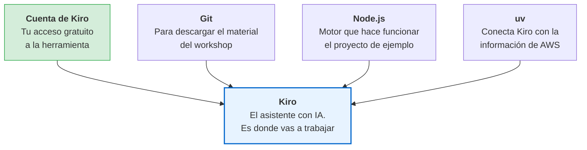
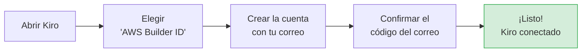

# Guía de instalación paso a paso

Esta guía te lleva de la mano para dejar todo listo antes del workshop. Está pensada para **cualquier
persona**, incluso si nunca instalaste un programa de este tipo.

> **Tiempo estimado:** 45 minutos. Hazlo con calma unos días antes, no el mismo día del workshop.
> Si algo sale mal, tienes tiempo de pedir ayuda.

Cada paso tiene sus instrucciones separadas para **Windows** y para **Mac**. Sigue solo las de tu
computador.

---

## Qué vamos a instalar y por qué

No te preocupes por entender todo ahora. Cada herramienta cumple un papel:



| Herramienta | En una frase | ¿Obligatoria? |
|-------------|--------------|:-------------:|
| **Kiro** | El programa principal, con el que trabajarás todo el workshop | Sí |
| **Cuenta de Kiro** | Tu acceso gratuito. Como crear una cuenta de correo | Sí |
| **Git** | Sirve para descargar el material del workshop a tu computador | Sí |
| **Node.js** | Hace funcionar el proyecto de ejemplo | Sí |
| **uv** | Conecta a Kiro con la documentación de AWS (Sesiones 1 y 2) | Sí |
| **Cuenta de AWS** | Solo si quieres explorar más. **No es obligatoria** | No |

> ¿Qué es una "terminal"? Es una ventanita donde uno escribe instrucciones en texto en lugar de usar
> el mouse. Suena intimidante pero solo vas a copiar y pegar lo que esta guía te indique. El
> [Glosario](./GLOSARIO.md) explica esta y otras palabras.

---

## Antes de empezar: abrir la terminal

Vas a necesitar la terminal varias veces. Aprende a abrirla primero.

### Windows

Presiona la tecla **Windows**, escribe `PowerShell`, y da clic en **Windows PowerShell**.

Se abre una ventana azul o negra con texto. Esa es la terminal.

> 
> *(Imagen de referencia: menú de inicio con PowerShell. La agrega el facilitador.)*

### Mac

Presiona **Command (⌘) + Barra espaciadora**, escribe `Terminal`, y presiona **Enter**.

Se abre una ventana con texto. Esa es la terminal.

> 
> *(Imagen de referencia: Spotlight buscando "Terminal". La agrega el facilitador.)*

> **Truco para toda la guía:** cuando te pidamos "escribe este comando", puedes copiarlo de aquí,
> pegarlo en la terminal (clic derecho o Command+V) y presionar **Enter**. No hace falta teclearlo.

---

## Paso 1: Instalar Kiro

Kiro es el programa principal del workshop.

1. Abre tu navegador y ve a **[kiro.dev](https://kiro.dev)**.
2. Da clic en el botón de descarga. La página detecta tu sistema (Windows o Mac) automáticamente.
3. Abre el archivo descargado e instálalo como cualquier otro programa:
   - **Windows:** doble clic en el archivo `.exe` y sigue el asistente (Siguiente → Siguiente → Instalar).
   - **Mac:** abre el archivo `.dmg` y arrastra el ícono de Kiro a la carpeta **Aplicaciones**.
4. Abre Kiro.

> 
> *(Imagen de referencia: botón de descarga en kiro.dev. La agrega el facilitador.)*

### Verificar

Si Kiro abre y muestra su pantalla de inicio, este paso está listo. Todavía falta iniciar sesión
(Paso 2).

---

## Paso 2: Crear tu cuenta e iniciar sesión en Kiro

Kiro es gratuito para empezar. Vas a crear un **AWS Builder ID**, que es una identidad gratuita de
AWS (no pide tarjeta de crédito).



1. En la pantalla de inicio de Kiro, elige **iniciar sesión con AWS Builder ID**.
2. Se abre tu navegador. Da clic en **crear un AWS Builder ID** (o "Create AWS Builder ID").
3. Escribe tu correo, tu nombre y una contraseña.
4. AWS te envía un código al correo. Cópialo y pégalo para confirmar.
5. Vuelve a Kiro. Debería quedar conectado con tu cuenta.

> 
> *(Imagen de referencia: opciones de login en Kiro. La agrega el facilitador.)*

### Sobre los créditos (importante)

El plan gratuito de Kiro incluye **50 créditos al mes**. El workshop consume entre 30 y 46, así que
alcanzan **si llegas con la cuenta sin usar ese mes**.

> **Consejo:** crea tu cuenta **dentro de los 14 días previos** al workshop. Las cuentas nuevas
> reciben créditos de bienvenida adicionales válidos por dos semanas, lo que te da margen de sobra.

Más detalle en [GESTION-CREDITOS.md](./GESTION-CREDITOS.md). Si tienes dudas de si te alcanzan,
pregúntale al facilitador antes del workshop.

### Verificar

En Kiro, abre el chat (el panel de conversación) y escribe:

```
Hola, responde en una línea para confirmar que estás funcionando.
```

Si responde, tu cuenta está lista.

---

## Paso 3: Instalar Git

Git sirve para descargar el material del workshop a tu computador.

### Windows

1. Ve a **[git-scm.com/download/win](https://git-scm.com/download/win)**. La descarga empieza sola.
2. Abre el archivo descargado.
3. En el asistente, acepta todas las opciones por defecto (**Next** en cada pantalla → **Install**).
   Son muchas pantallas; está bien dejar todo como viene.

> **Detalle útil:** durante la instalación, Git también instala **Git Bash**, una terminal que hace
> que los comandos del workshop funcionen igual que en Mac. La vamos a usar.

### Mac

En Mac, Git suele venir incluido. Para confirmarlo o instalarlo:

1. Abre la Terminal (ver arriba).
2. Escribe este comando y presiona Enter:
   ```bash
   git --version
   ```
3. Si muestra un número de versión, ya lo tienes. Si en cambio aparece una ventana ofreciendo
   instalar "herramientas de desarrollador de línea de comandos", acéptala.

### Verificar (Windows y Mac)

En la terminal, escribe:

```bash
git --version
```

Debe responder algo como `git version 2.40.0` (el número puede variar). Si lo hace, listo.

> 
> *(Imagen de referencia: terminal mostrando la versión de Git. La agrega el facilitador.)*

---

## Paso 4: Instalar Node.js

Node.js hace funcionar el proyecto de ejemplo del workshop.

### Windows y Mac (igual para ambos)

1. Ve a **[nodejs.org](https://nodejs.org)**.
2. Descarga la versión que dice **LTS** (es la estable y recomendada).
3. Abre el archivo e instálalo aceptando las opciones por defecto.

> 
> *(Imagen de referencia: nodejs.org señalando el botón LTS. La agrega el facilitador.)*

### Verificar

**Cierra y vuelve a abrir la terminal** (esto es importante después de instalar Node), y escribe:

```bash
node --version
```

Debe responder algo como `v20.11.0` o superior. Si el número empieza en `v20` o más, perfecto.

---

## Paso 5: Instalar uv

`uv` es una herramienta pequeña que permite a Kiro conectarse con la documentación de AWS. Se usa en
las dos sesiones.

### Windows

1. Abre **PowerShell**.
2. Copia y pega este comando completo, y presiona Enter:
   ```powershell
   powershell -ExecutionPolicy ByPass -c "irm https://astral.sh/uv/install.ps1 | iex"
   ```
3. Espera a que termine. Cierra y vuelve a abrir PowerShell.

### Mac

1. Abre la Terminal.
2. Copia y pega este comando completo, y presiona Enter:
   ```bash
   curl -LsSf https://astral.sh/uv/install.sh | sh
   ```
3. Espera a que termine. Cierra y vuelve a abrir la Terminal.

> **Alternativa en Mac (si usas Homebrew):** `brew install uv`

### Verificar (Windows y Mac)

En la terminal, escribe:

```bash
uv --version
```

Debe responder con un número de versión. Si dice algo como `uv 0.5.0`, listo.

### Una prueba extra recomendada

Este comando descarga por adelantado una de las herramientas que usaremos, para que el día del
workshop arranque rápido. Puede tardar un par de minutos la primera vez:

```bash
uvx awslabs.aws-documentation-mcp-server@latest --help
```

Si imprime un texto de ayuda (o se queda esperando, en cuyo caso presiona **Ctrl + C** para
cortarlo), funcionó.

---

## Paso 6: Descargar el material del workshop

Ahora traes este repositorio a tu computador.

1. Abre la terminal (en **Windows usa Git Bash**, que instalaste en el Paso 3; búscala en el menú de
   inicio).
2. Escribe estos comandos uno por uno, presionando Enter después de cada uno:

```bash
git clone [URL-DEL-REPOSITORIO] workshop-kiro-fdlm
cd workshop-kiro-fdlm
npm install
```

> El facilitador te dará la `[URL-DEL-REPOSITORIO]` exacta. Es una dirección web que termina en `.git`.

**Qué hace cada comando:**
- `git clone ...` descarga el material a una carpeta llamada `workshop-kiro-fdlm`.
- `cd workshop-kiro-fdlm` entra a esa carpeta.
- `npm install` prepara el proyecto (descarga las piezas que necesita). Tarda uno o dos minutos.

### Verificar

Todavía en la terminal, escribe:

```bash
npm test
```

Debe aparecer algo con la palabra **PASS** y "11 passed" o similar. Eso significa que el proyecto
funciona en tu computador.

> 
> *(Imagen de referencia: terminal mostrando los tests en verde. La agrega el facilitador.)*

---

## Paso 7: Abrir el proyecto en Kiro

1. Abre Kiro.
2. Ve a **File → Open Folder** (Archivo → Abrir carpeta).
3. Busca y selecciona la carpeta `workshop-kiro-fdlm` que descargaste.
4. Kiro carga el proyecto. Ya puedes ver los archivos a la izquierda.

Para confirmar que Kiro "ve" el proyecto, abre el chat y escribe:

```
¿En qué carpeta estoy trabajando?
```

Si responde con la ruta de `workshop-kiro-fdlm`, todo está listo.

---

## Lista de verificación final

Marca cada casilla. Si todas están marcadas, llegarás al workshop sin sorpresas.

- [ ] **Kiro** instalado y abre correctamente
- [ ] **Sesión iniciada** en Kiro (responde en el chat)
- [ ] **Créditos** revisados (al menos 45 disponibles, o avisé al facilitador)
- [ ] `git --version` responde
- [ ] `node --version` responde con v20 o superior
- [ ] `uv --version` responde
- [ ] Material descargado y `npm test` en verde
- [ ] Proyecto abierto en Kiro

---

## Si algo no funcionó

No te frustres: estos tropiezos son normales y casi todos tienen solución rápida.

| Lo que ves | Qué significa | Qué hacer |
|------------|---------------|-----------|
| `command not found` o `no se reconoce` | La terminal no encuentra el programa recién instalado | Cierra y vuelve a abrir la terminal. Si sigue, reinicia el computador |
| Kiro no responde en el chat | La sesión se cerró | Vuelve a iniciar sesión con tu AWS Builder ID |
| Kiro dice que no hay créditos | Se agotó la cuota del mes | Avísale al facilitador; trabajarás en pareja o te asignan una licencia |
| `npm install` se queda pegado o falla | Puede ser la red de tu oficina | Prueba desde otra red, o avisa a tu área de tecnología (puede haber un "proxy") |
| No encuentro Git Bash en Windows | Se instaló con Git | Búscalo en el menú de inicio escribiendo "Git Bash" |
| La descarga de `uv` falla | Red restringida | Escribe al canal de soporte del workshop antes del día |
| Nada de esto ayuda | — | Escribe al **canal de soporte del workshop** con una captura de lo que ves. Mejor resolverlo antes que el día de la sesión |

> **Regla de oro:** cuando algo falle, tómale una **captura de pantalla** y compártela en el canal de
> soporte. Una imagen dice más que mil descripciones, y el facilitador podrá ayudarte más rápido.

---

## Siguiente

Con todo instalado, revisa el [checklist de preparación](../PREPARACION.md) y nos vemos en la
[Sesión 1](../sesion-1/00-bienvenida.md).
