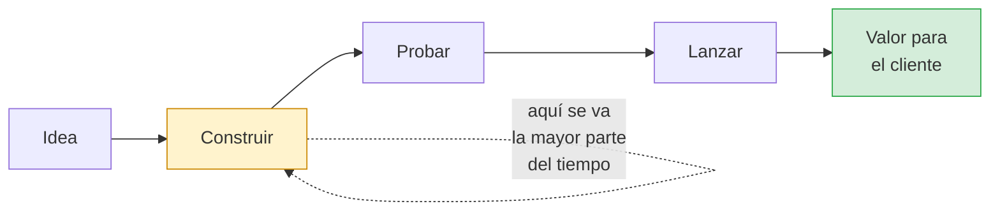

# Kiro esencial: Vibe, Spec, autonomía y créditos

**Sesión 1 · Minuto 08–20 · 12 minutos (teoría + demo del facilitador)**

---

## 0. Por qué estamos aquí (2 min, para todos los perfiles)

Antes de lo técnico, el porqué. El software es hoy el motor del crecimiento de casi cualquier
organización: los servicios digitales, la atención al cliente, los procesos internos. **Quien
construye software más rápido y con más calidad, crece más rápido.**

El cuello de botella casi nunca es la falta de ideas. Es el tiempo que toma convertirlas en algo real:



Kiro ataca justamente esa parte lenta. Y no solo escribiendo código: también en lo que *siempre* se
posterga por falta de tiempo —documentar, probar, dejar todo listo para operar— que es lo que después
genera retrabajo, errores e incidentes.

| Sin una herramienta como Kiro | Con Kiro |
|-------------------------------|----------|
| Entender un proyecto ajeno toma días | Toma minutos |
| La documentación "se hace después" (nunca) | Se genera junto con el trabajo |
| Preparar todo para la nube toma semanas | Toma horas |
| El conocimiento vive en la cabeza de una persona | Queda escrito y compartido |

> **En una frase de negocio:** menos tiempo de idea a mercado, menos costo por entrega, menos riesgo
> de depender de una sola persona. Eso es lo que vamos a ver funcionando en las próximas dos sesiones.

---

## 1. Qué es Kiro, y qué no es

Kiro es un **entorno de desarrollo agéntico** de AWS, construido sobre VS Code. La palabra clave es
*agéntico*: no completa la línea que estás escribiendo, ejecuta tareas.

```
┌─────────────────────────────────────────────────────────────────────┐
│  Autocompletado          →  sugiere el resto de la línea            │
│  Chat de código          →  responde preguntas sobre código         │
│  Agente (Kiro)           →  lee el repo, edita varios archivos,     │
│                             corre comandos, verifica el resultado   │
└─────────────────────────────────────────────────────────────────────┘
```

Esa diferencia cambia cómo se trabaja. Con un agente el trabajo ya no es escribir código: es
**especificar bien y verificar bien**.

### Las cinco capacidades que vamos a usar

| Capacidad | Qué resuelve | Lab |
|-----------|--------------|-----|
| Sesiones Vibe / Spec | Explorar o planificar antes de implementar | Todos |
| Steering files | Que Kiro conozca los estándares del equipo sin repetírselos | Lab 2 |
| Hooks | Automatizar validaciones ante eventos del IDE | Lab 3 |
| MCP | Conectar Kiro a fuentes externas confiables | Lab 4 |
| Terminal y ejecución | Que Kiro corra tests y valide su propio trabajo | Labs 5–7 |

---

## 2. Vibe y Spec

Dos formas de trabajar, para dos tipos de problema.

### Sesión Vibe

Conversación libre. Preguntas, exploras, pides un cambio, iteras.

```
Tú: "Explícame qué hace src/corresponsales/limites.js"
Tú: "Agrégale JSDoc en español"
Tú: "Ahora genera los tests"
```

Ideal para: entender código, cambios de uno a tres archivos, generar un artefacto concreto,
preguntas puntuales. **Es el modo de todos los labs de este workshop.**

### Sesión Spec

Flujo estructurado en tres etapas, cada una revisable antes de continuar:

```
   REQUISITOS  →  DISEÑO  →  TAREAS  →  EJECUCIÓN
       │            │          │           │
   qué hay que   cómo se    lista de   Kiro ejecuta
   construir     resuelve   pasos      tarea por tarea
       │            │          │
       └─ revisas ──┴─ revisas ┘
```

Ideal para: features que tocan muchos archivos, cambios donde las decisiones de diseño importan y
hay que dejarlas escritas, trabajo que se reparte entre varias personas.

El valor real de Spec no es que genere más código. Es que **el requisito y el diseño quedan
documentados y versionados** junto al código. Para una entidad financiera, donde hay que poder
explicar por qué el sistema hace lo que hace, eso no es un detalle.

### Cuál usar

| Situación | Modo |
|-----------|------|
| "No entiendo este módulo" | Vibe |
| "Necesito un test para esta función" | Vibe |
| "Hay que agregar un nuevo tipo de transacción a todo el flujo" | Spec |
| "Rediseñar el módulo de liquidación de comisiones" | Spec |
| "Genérame esta plantilla de CloudFormation" | Vibe |
| "Diseñar la arquitectura completa del servicio en AWS" | Spec |

> **Nota sobre créditos:** una sesión Spec consume bastante más que un prompt en Vibe. Por eso en
> este workshop Spec se ve como **demo del facilitador** y los labs se hacen en Vibe. Cuando tengas
> un plan con cuota holgada, Spec es donde Kiro brilla más.

---

## 3. Modos de autonomía

Aplican a los dos tipos de sesión.

| Modo | Comportamiento | Cuándo usarlo |
|------|----------------|---------------|
| **Autopilot** (por defecto) | Kiro aplica los cambios de forma autónoma. Puedes revisar, revertir o interrumpir en cualquier momento. | Trabajo exploratorio, código no crítico, cuando quieres velocidad |
| **Supervisado** | Kiro pide aprobación tras cada turno con ediciones, presentando los cambios como bloques individuales para aceptar o rechazar. | Código sensible, módulos regulados, cuando estás aprendiendo a confiar en la herramienta |

Para los labs de hoy: **Autopilot**. Vas a generar mucho y revertir es fácil.
Para tu módulo de cálculo de intereses en producción: **Supervisado**.

---

## 4. Contexto: la variable que más mueve la aguja

Kiro responde según el contexto que tiene. Hay tres formas de darle contexto, de menos a más
efectiva:

```
1. Implícito     Kiro busca en el repositorio por su cuenta
                 → funciona, pero puede mirar donde no importa

2. Explícito     Tú le dices exactamente qué mirar con #
                 → #File, #Folder, #Problems, #Terminal, #Git Diff

3. Persistente   Lo escribes una vez en un steering file
                 → aplica a todas las interacciones, no lo repites nunca más
```

El nivel 3 es el Lab 2, y es la diferencia entre usar Kiro como buscador y usarlo como
miembro del equipo que ya conoce las reglas.

---

## 5. Créditos, en 60 segundos

- Kiro cobra por **crédito**, no por mensaje. El consumo es fraccionario (incrementos de 0,01).
- Un prompt simple cuesta menos de 1 crédito. Generar un archivo completo, entre 1 y 3.
- El plan **Free** trae **50 créditos al mes**, que no se acumulan.
- **Los hooks de tipo agente consumen créditos cada vez que se disparan.** Es la trampa más común.
- El agente `Auto` es el más eficiente por crédito. No lo cambies hoy.

Detalle completo en [docs/GESTION-CREDITOS.md](../docs/GESTION-CREDITOS.md).

---

## 6. Demo del facilitador (4 min)

Es la única demo de la sesión: dentro de los labs el tiempo es de los participantes.

El facilitador muestra, sobre el repositorio del workshop:

### 6.1 Vibe: entender código en un prompt

> Explícame en 5 líneas qué hace el módulo `src/corresponsales/` y cómo se relacionan sus archivos.

Puntos a señalar mientras responde: Kiro leyó varios archivos sin que se le dijera cuáles, y su
respuesta se apoya en el código real, no en suposiciones.

### 6.2 Contexto explícito con `#`

> #File src/corresponsales/limites.js
> ¿Hay algún caso de borde mal manejado en estas validaciones?

Señalar: la diferencia de precisión al acotar el contexto.

### 6.3 Spec: cómo se ve el flujo estructurado

El facilitador inicia una sesión Spec con:

> Necesito agregar un nuevo tipo de transacción `TRANSFERENCIA` al servicio de corresponsales,
> con su tarifa, su límite, sus validaciones y sus tests.

**No se ejecuta.** Solo se muestra el documento de requisitos y el de diseño que Kiro produce, y se
señala que quedan como archivos versionables. Luego se cancela.

Este es el punto de la demo: en Spec, antes de que se escriba una línea de código, ya existe
un documento que explica qué se va a construir y por qué.

### 6.4 Lo que hay que ver

```
┌──────────────────────────────────────────────────────────────┐
│  ✓ Kiro lee el repositorio, no adivina                       │
│  ✓ El contexto explícito con # mejora la precisión           │
│  ✓ Spec deja el razonamiento por escrito antes del código    │
│  ✓ Todo cambio es visible y reversible                       │
│  ✓ La responsabilidad de verificar sigue siendo tuya         │
└──────────────────────────────────────────────────────────────┘
```

---

## 7. Lo que Kiro no resuelve

Vale decirlo antes de empezar a generar:

- **No sabe lo que no le dijiste.** Las reglas de negocio de la entidad, las políticas internas,
  el porqué de una decisión de hace tres años: eso lo pones tú (o lo pones en un steering file).
- **Puede equivocarse con confianza.** Un resultado bien formateado no es un resultado correcto.
  De ahí que cada lab termine con una verificación ejecutable.
- **No decide por ti en lo que importa.** Arquitectura, riesgo, cumplimiento y priorización siguen
  siendo trabajo humano.
- **No reemplaza el criterio.** Acelera a quien sabe lo que quiere. A quien no, lo acelera hacia
  el lugar equivocado.

---

## Resumen

```
┌─────────────────────────────────────────────────────────────┐
│  PARA LLEVAR                                                │
├─────────────────────────────────────────────────────────────┤
│  ✓ Kiro es un agente, no un autocompletado                  │
│  ✓ Vibe para explorar; Spec para planificar y documentar     │
│  ✓ Autopilot para velocidad; Supervisado para código crítico │
│  ✓ El contexto es la palanca: implícito < explícito < steering│
│  ✓ Los créditos son finitos; el prompt vago es el que cuesta │
│  ✓ Generar es rápido; verificar sigue siendo tu trabajo      │
└─────────────────────────────────────────────────────────────┘
```

---

## Siguiente

[Lab 1: Onboarding asistido sobre código desconocido →](./lab1-onboarding/README.md)
